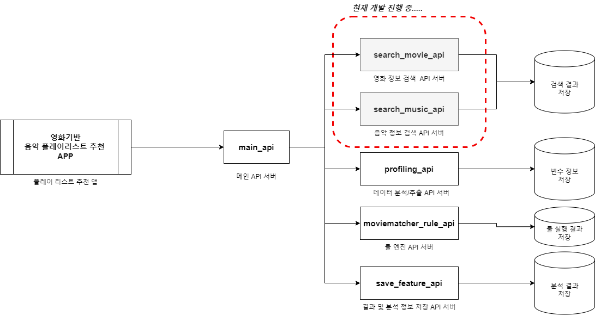

Create a new repository on the command line
-------------
* git init
* git add README.md
* git commit -m "first commit"
* git branch -M master
* git remote add origin https://github.com/hop-hi/coding.git
* git push -u origin master

Push an existing repository from the command line
-------------
* git remote add origin https://github.com/hop-hi/coding.git
* git branch -M master
* git push -u origin master

